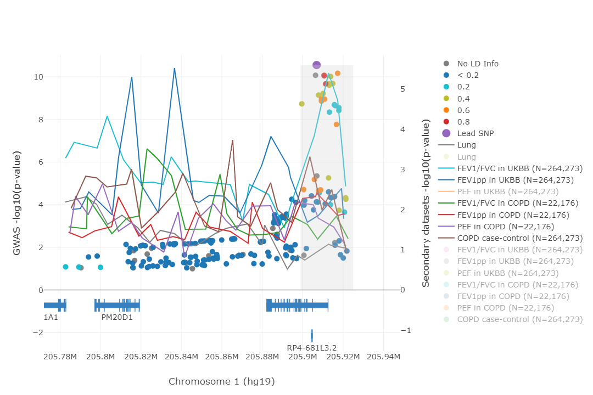

# Introduction

This project contains the steps undertaken to perform association analyses of spirometry measures in the UK Biobank (UKBB) with variants around _SLC26A9_ gene for patients with spirometry-defined COPD with modified [GOLD criteria 2-4 of moderate to very severe lung function](https://pubmed.ncbi.nlm.nih.gov/17765526/). The definition here is relaxed in that measurements are not required to be post-bronchodilator measurements. According to [Mannino and Buist, 2007](https://pubmed.ncbi.nlm.nih.gov/17765526/), in instances where pre-bronchodilator lung function has been recorded, an overestimate of airflow obstruction may result.

# Analysis

  1. [01-extract_phenos_of_interest.sh](code/01-extract_phenos_of_interest.sh)  
      - input:  
          - `ukb24727.tab`, which contains all phenotypic information from UKBB        
      - output:  
          - `ukb24727_spirometry.tab`, a smaller file containing the required variables only  

  2. [02-subset_qc_copd_individuals.R](code/02-subset_qc_copd_individuals.R)  
      - input:  
          - `ukb24727_spirometry.tab`
      - output:  
          - `ukbb_spiro_and_geno_qc.csv`, which contains all the individuals passing spirometry and genotyping QC, and their spirometry measures (best FEV1, best FVC, and FEV1pp)
          - `GOLD2-4_copd_ukbb_spirodata.csv`, which is the subset of individuals from `ukbb_spiro_and_geno_qc.csv` that fit GOLD class 2-4 criteria for lung function (i.e. FEV1/FVC ratio &lt; 0.7 and FEV1pp &lt; 80&percnt;)  
          
      This step removes individuals that did not pass spirometry and genotyping QC, removes related and non-European individuals, and calculates FEV1pp using the [GLI calculator](http://gli-calculator.ersnet.org/index.html) (Global Lung Function Initiative 2021, version 2.0). The procedure is similar to [Shrine _et al._ 2019](https://www.nature.com/articles/s41588-018-0321-7) with the exception of removal of related individuals, where KING's `--unrelated` option (v2.0) was used here to obtain the unrelated set, which results in the removal of 36,004 participants versus 1,165 in [Shrine _et al._](https://www.nature.com/articles/s41588-018-0321-7). Another key difference is that we removed non-Europeans using UKBB's [VariableID 22006](https://biobank.ndph.ox.ac.uk/showcase/field.cgi?id=22006), whereas [Shrine _et al._](https://www.nature.com/articles/s41588-018-0321-7) opted for a K-means clustering method. Taken together, [Shrine _et al._](https://www.nature.com/articles/s41588-018-0321-7)'s method yields 321,047 participants, whereas our method yields 264,273.    

  3. [03-pca.sh](code/03-pca.sh)  
      - input: genotype array data for:  
          - All individuals defined in `GOLD2-4_copd_ukbb_spirodata.csv`  
          - All individuals defined in `ukbb_spiro_and_geno_qc.csv`
      - output:  
          - `15-ukbb_copd_pcair_eigenvectors.txt` for individuals corresponding to `GOLD2-4_copd_ukbb_spirodata.csv`  
          - `18-ukbb_ukbbspiro_flashpca2_eigenvectors.txt` for individuals corresponding to `ukbb_spiro_and_geno_qc.csv`

      [FlashPCA](https://academic.oup.com/bioinformatics/article/33/17/2776/3798630) v2.1 was used to calculate the principal components.

  4. [04-assoc_spirometry.R](code/04-assoc_spirometry.R)
      - inputs:
          - `ukbb_spiro_and_geno_qc.csv`
          - `15-ukbb_copd_pcair_eigenvectors.txt`, derived from genotyped array data from UKBB using [flashPCA2](https://academic.oup.com/bioinformatics/article/33/17/2776/3798630) (v2.1)
          - `18-ukbb_ukbbspiro_flashpca2_eigenvectors.txt`, derived from genotyped array data from UKBB using [flashPCA2](https://academic.oup.com/bioinformatics/article/33/17/2776/3798630) (v2.1)
          - `ukb_imp_chr1_v3.bgen`, which is the imputation dataset provided by UKBB
      - output:
          - `ratio.irnt.assoc.csv`, association results for FEV1/FVC ratio among all 264,273 UKBB participants
          - `fev1pp.irnt.assoc.csv`, association results for FEV1pp among all 264,273 UKBB participants
          - `pef.irnt.assoc.csv`, association results for PEF among all 264,273 UKBB participants
          - `ratio.irnt.assoc_copd_only.csv`, association results for FEV1/FVC ratio among all UKBB participants with spirometrically-defined COPD as per GOLD2-4 (N=22,176)
          - `fev1pp.irnt.assoc_copd_only.csv`, association results for FEV1pp among all 264,273 UKBB participants with spirometrically-defined COPD as per GOLD2-4 (N=22,176)
          - `pef.irnt.assoc_copd_only.csv`, association results for PEF among all 264,273 UKBB participants with spirometrically-defined COPD as per GOLD2-4 (N=22,176)
          - `hasCOPD.assoc.csv`, case-control association analysis of spirometrically-defined COPD cases (GOLD2-4), against those with healthy lung function (22,176 cases versus 242,097 controls)

  5. [merge_and_convert_to_html.py](locusfocus_prep/merge_and_convert_to_html.py)  
      - inputs: the association files:
          - `ratio.irnt.assoc.tsv`
          - `fev1pp.irnt.assoc.tsv`
          - `ratio.irnt.assoc_copd_only.tsv`
          - `fev1pp.irnt.assoc_copd_only.tsv`
          - `hasCOPD.assoc.tsv`
      - output:
          - [spirometry_in_ukbb.html](locusfocus_prep/spirometry_in_ukbb_v3.html) for use in [LocusFocus](https://locusfocus.research.sickkids.ca) as secondary datasets to test colocalization  

This step prepares the association results for loading as secondary datasets into [LocusFocus](https://locusfocus.research.sickkids.ca)  

# Results  

The [GWAS of Meconium Ileus (MI)](https://journals.plos.org/plosgenetics/article?id=10.1371/journal.pgen.1008007) at chr1:205,780,000-205,940,000 was tested for colocalization against the lung function phenotypic associations derived above, to test for the pleiotropic effects of this modifier locus of Cystic Fibrosis (CF) on lung function.  

Colocalization was observed when the genome-wide associated peak was tested:  

*[LocusFocus](https://locusfocus.research.sickkids.ca) plot testing colocalization of [MI GWAS](https://journals.plos.org/plosgenetics/article?id=10.1371/journal.pgen.1008007) (shown as points and corresponding left y-axis) with UKBB spirometry measures in all participants and in participants with COPD as per GOLD2-4 definitions (shown as lines traversing the lowest p-values per window with corresponding right y-axis). The `Lung` line is the GTEx eQTL of _SLC26A9_ in the adult lung. The Simple Sum colocalization region tested (gray area) was selected to match the observed peak at chr1:205,899,000-205,925,000. A total of 87 SNPs in this region were used to test for colocalization using the [Simple Sum method](https://www.biorxiv.org/content/biorxiv/early/2021/08/07/2021.08.06.455333.full.pdf).*

*Same colocalization plot as above but with PEF association line removed and other association datasets rescaled for better visualization*

Colocalization results obtained are summarized in [UKBB_spirometry_SS_pvalues.csv](products/locusfocus_results/peak_test_205899-205925kbp_v2/UKBB_spirometry_SS_pvalues.csv). In short, the MI GWAS colocalizes with FEV1/FVC ratio and PEF (peak expiratory flow) association studies from the UKBB, and this colocalization is found to be statistically significant after [multiple testing correction](products/locusfocus_results/peak_test_205899-205925kbp_v2/SSguidanceTable.csv) (-log10P > 1.78).

| Dataset | Simple Sum colocalization -log10(P-value) |
|---|---|
|FEV1/FVC in UKBB (N=264,273)|6.48|
|PEF in UKBB (N=264,273)|7.89|
|FEV1pp in UKBB (N=264,273)|Did not pass first stage test|
|FEV1/FVC in COPD (N=22,176)|Did not pass first stage test|
|FEV1pp in COPD (N=22,176)|Did not pass first stage test|
|COPD case-control (N=264,273)|Did not pass first stage test|

